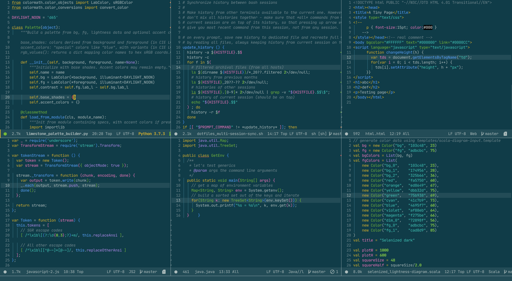

🔥 **I need your opinion!** 🔥

There are some design decisions that need to be made to complete editor support.
Your feedback would be very helpful - please comment on [issue
74](https://github.com/jan-warchol/selenized/issues/74).



The font used in the screenshot is [JetBrains
Mono](https://www.jetbrains.com/lp/mono/).


Installation
------------

1. Copy theme file inside your DOOMDIR.
1. Append this to your `config.el`:
  ``` lisp
  (add-to-list 'custom-theme-load-path (doom-dir))
  (setq doom-theme 'doom-selenized-dark)
  ```
